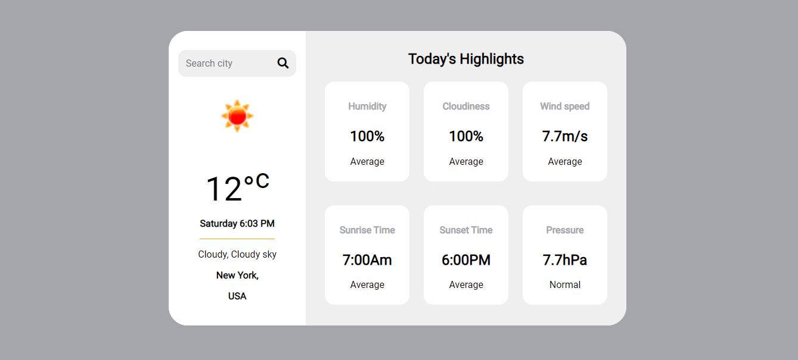

# weather_api_app

### Overview

This is an vanila js app where you can enter a city and it will give the temperature, humidity, cloudiness, pressure, wind speed, sunrise,sunset.

### Screenshot

### Link

[Live demo](https://weather-smk.netlify.app/)

### Bulid with

- Html
- CSS
- Javascript
- Responsive

### What I learned.

- In this project I have learned converting UTC to time to Iso time and other date manipulation.
- This project helped me to recall the api concepts.

### What I used.

- Design -[Anton Mikhaltsov](https://dribbble.com/shots/10460680-Weather-App)
- Api - [openweather](https://openweathermap.org/)

### Author

- Website - [Manikandan](https://manikandan.netlify.app/)
- Twitter - [@\_manismk](https://www.twitter.com/_manismk)
